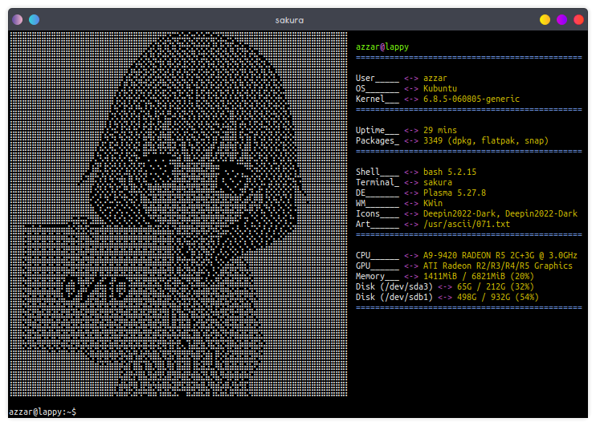
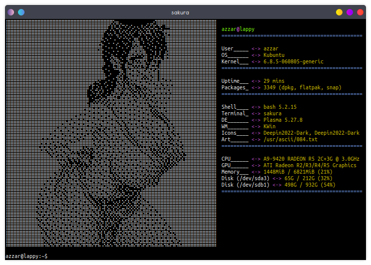

# my rice for sakura and neofetch

it's a repo containing my setup for the sakura terminal and neofetch

## what you need to follow

1. put the `config.conf` to `/home/[username]/.config/neofetch/` or where you put your neofetch config file are.
2. put the `sakura.conf` to `/home/[username]/.config/sakura/` or where you put your sakura config file are.
3. put the ascii folder and its content on to `/usr/` folder

### how to use

1. do all the above part
2. done
3. now you will have the ability to loop all the ascii art automaticaly by using `looper` command on your terminal.
4. your neofetch theme will be as the same as on the example demo.

## demo

1. 
2. 
